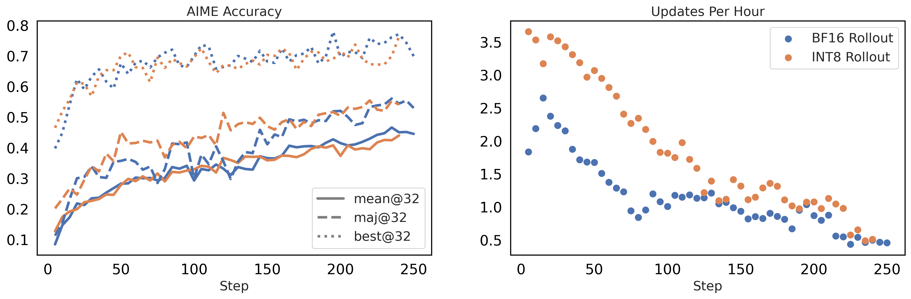

<h1 align="center">⚡ FlashRL ⚡</h1>
<p align="center"><b>Fast RL training with Quantized Rollouts </b>  
(<a href="https://fengyao.notion.site/flash-rl">Blog</a>)</p>

<p align="center">
  
  
    
</p>

<p align="center">
  <a href="#-flashrl-">What is FlashRL?</a> •
  <a href="#-quick-start">Quick Start</a> •
  <a href="#-usage-guide">Usage Guide</a> •
  <a href="#-examples">Examples</a> •
  <a href="#-road-map">Road Map</a> •
  <a href="#-citation">Citation</a>
</p>


[FlashRL](https://fengyao.notion.site/flash-rl) patches the inference backend to generate RL rollouts in INT8 \& FP8, with accurate rollout logprob. 


*Figure 1. **Left**: AIME accuracy of Qwen2.5-32B DAPO training with <span style="color: #ff7f0e;">INT8</span> and <span style="color: #1f77b4;">BF16</span> precisions for rollout generation using vLLM engine. **Right**: Training throughput (updates per hour) in the DAPO training (vLLM + BF16 FSDP).*

## ⚡ Quick Start

### Installation

```bash
pip install flash-llm-rl # need to be installed in all nodes in multi-node training
```

(Optional) there are two options to verify the FlashRL install: 1) set `FLASHRL_LOGGING_LEVEL` to `DEBUG` and compare the log with the [provided ones](#examples); 2) for more details / debugging, please follow the [Tutorial](tutorial.md). 

### Rollout Generation w. FP8 Quantization
FlashRL is implemented as a plug-in-and-play manner, using [environment variables](#patcher) `FLASHRL_CONFIG` to control the quantization precision.

```bash 
# for single-node job
export FLASHRL_CONFIG=fp8
bash verl/examples/ppo_trainer/run_qwen2.5-32b.sh

# alternatively, for multi-node jobs via `ray submit`, fp8 online quantization will be turned on via
# > echo "  FLASHRL_CONFIG: 'fp8'" | tee -a verl/trainer/runtime_env.yaml # add `FLASHRL_CONFIG: 'fp8'` to runtime env
# > bash verl/recipe/dapo/run_dapo_qwen2.5_32b.sh # this can be any scripts
```

### RL Logprob Patch Only
Setting the config to `bf16` to extract precise logprob used in sampling without rollout quantization. This is useful for applying the [Truncated Importance Sampling](https://fengyao.notion.site/off-policy-rl?source=copy_link). 

```bash 
#  for single-node job
export FLASHRL_CONFIG=bf16
bash verl/examples/ppo_trainer/run_qwen2.5-32b.sh

# alternatively, for multi-node jobs via `ray submit`, RL Logprob Patch Only will be turned on via
# > echo "  FLASHRL_CONFIG: 'bf16'" | tee -a verl/trainer/runtime_env.yaml # add `FLASHRL_CONFIG: 'fp8'` to runtime env
# > bash verl/recipe/dapo/run_dapo_qwen2.5_32b.sh # this can be any scripts
```

## Usage Guide

FlashRL has 3 major functionality, `profiling`, `configure helper`, and `patcher`. 

### Profiling (optional for `fp8` and `bf16`)

This step is not needed for the native `fp8` online quantization supported by `vLLM`, and the logprog-only path `bf16`, and is needed for `int8` or `fp8_channel` quantization. Specifically, profilling compares a `bf16` model and a quantized model to decide how the online quantization should be performed for an updated model. Please find below an example for `Qwen/Qwen2.5-32B` and `Qwen/Qwen2.5-0.5B-Instruct`. 

```bash
# for `Qwen/Qwen2.5-32B`
flashrl profile -m Qwen/Qwen2.5-32B -qm LiyuanLucasLiu/Qwen2.5-32B-quantized.w8a8 -o ${PROFILE_PATH:-"$HOME/profile.32b.pt"} --fn int8

# for `Qwen/Qwen2.5-0.5B-Instruct`
flashrl profile -m Qwen/Qwen2.5-0.5B-Instruct -qm RedHatAI/Qwen2.5-0.5B-Instruct-quantized.w8a8 -o ${PROFILE_PATH:-"$HOME/profile.0_5b.pt"} --fn int8
```

### Configure Helper (optional for `fp8` and `bf16`)

This step is not needed for the native `fp8` online quantization supported by `vLLM`, and the logprog-only path `bf16`, and is needed for `int8` or `fp8_channel` quantization. Specifically, configure helper creates a yaml file for the patcher to use. Please find below an example for `Qwen/Qwen2.5-32B` and `Qwen/Qwen2.5-0.5B-Instruct`. 

```bash
# for `Qwen/Qwen2.5-32B`
flashrl setup -m LiyuanLucasLiu/Qwen2.5-32B-quantized.w8a8 -p $HOME/profile.32b.pt --fn int8 -o ${CONFIG_PATH:-"$HOME/.flashrl_config.32b.yaml"}

# for `Qwen/Qwen2.5-0.5B-Instruct`
flashrl setup -m RedHatAI/Qwen2.5-0.5B-Instruct-quantized.w8a8 -p $HOME/profile.0_5b.pt --fn int8 -o ${CONFIG_PATH:-"$HOME/.flashrl_config.0_5b.yaml"}
```

### Patcher

Patcher would check the environment variable and operates accordingly. Please find the supported environment variables as below. 

|  Environment Variable | Usage | 
|--|--|
| `FLASHRL_CONFIG` | applies patcher if configured, supports `bf16`, `fp8`, local profile paths (e.g., `$HOME/.flashrl_config.32b.yaml`), and uploaded profiles (e.g., `LiyuanLucasLiu/Qwen2.5-0.5B-Instruct-quantized.w8a8-RedHatAI/flashrl_config.yaml`) |
| `FLASHRL_LMHEAD_FP32` | if set to `1`, forcing `vLLM` conducting `lm head` compute in `bf16`
| `FLASHRL_LOGGING_LEVEL` | set to `DEBUG` to turn on verbose logging for FlashRL functions |
| `FLASHRL_LOGGING_FILE` | if set, will save the log to files as well | 
| `FLASHRL_TEST_RELOAD` | functionality provided to test FlashRL install, check [TODO: add link to tutorial] for more details |

## Examples

| Run Detail | Script | Command | Log |
|--|--|--|--|
| INT8 Rollout for Qwen2.5-0.5B-Instruct on GSM8K | [Script](https://github.com/yaof20/verl/blob/flash-rl/recipe/flash_rl/gsm8k_qwen0_5b_int8.sh) | `bash recipe/flash_rl/gsm8k_qwen0_5b_int8.sh flash-int8-TIS-2 2` | [Wandb](https://wandb.ai/llychinalz/Flash-GSM8K?nw=2yfyyqo0fm) [Log](https://github.com/yaof20/verl/blob/flash-rl/recipe/flash_rl/logs/gsm8k_int8.log) |
| INT8 Rollout for Qwen2.5-32B-Instruct on DAPO | [Script](https://github.com/yaof20/verl/blob/flash-rl/recipe/flash_rl/dapo_qwen32b_int8.sh) | `bash recipe/flash_rl/dapo_qwen32b_int8.sh flash-int8-TIS-8 8` | [Wandb](https://wandb.ai/llychinalz/Flash-DAPO/?nw=w2j18d5w12) |
| FP8 Rollout for Qwen2.5-0.5B-Instruct on DAPO | [Script](https://github.com/yaof20/verl/blob/flash-rl/recipe/flash_rl/gsm8k_qwen0_5b_fp8.sh) | `bash recipe/flash_rl/gsm8k_qwen0_5b_fp8.sh flash-fp8-TIS-2 2` | [Wandb](https://wandb.ai/llychinalz/Flash-GSM8K?nw=cih3nmuhn8p) [Log](https://github.com/yaof20/verl/blob/flash-rl/recipe/flash_rl/logs/gsm8k_fp8.log) |
| FP8 Rollout for Qwen2.5-32B-Instruct on DAPO | [Script](https://github.com/yaof20/verl/blob/flash-rl/recipe/flash_rl/dapo_qwen32b_int8.sh) | `bash recipe/flash_rl/dapo_qwen32b_fp8.sh flash-fp8-TIS-8 8`| IN Progress |

## 🚧 Roadmap & Future Improvements

We're working on several improvements to Flash-RL:

- [ ] **Support of Other RL Toolkits**: Currently Flash-RL only supports `VeRL`, we are working on rolloing out support for other packages like `OpenRLHF`
- [ ] **Support of Other LLM Inference Toolkits**: Currently Flash-RL only supports `vLLM`, we are working on rolloing out support for other tollkits like `SgLang`
- [ ] **Further Throughput Optimization**: We are working on implementing efficient GPU kernels to accelerate online quantization

## 📚 Citation

If you find our work useful, please cite us:

```bibtex
@misc{yao2025offpolicy,
  title = {Your Efficient RL Framework Secretly Brings You Off-Policy RL Training},
  url = {https://fengyao.notion.site/off-policy-rl},
  author = {Yao, Feng and Liu, Liyuan and Zhang, Dinghuai and Dong, Chengyu and Shang, Jingbo and Gao, Jianfeng},
  journal = {Feng Yao's Notion},
  year = {2025},
  month = aug,
}
@misc{yao2025flashrl,
  title = {Flash-RL: Fast RL training with Quantized Rollouts},
  url = {https://fengyao.notion.site/flash-rl,
  author = {Liu, Liyuan and Yao, Feng and Zhang, Dinghuai and Dong, Chengyu and Shang, Jingbo and Gao, Jianfeng},
  journal = {Feng Yao's Notion},
  year = {2025},
  month = aug,
}
```

## Questions?

If you have any questions related to the code or the blog, feel free to reach out to us at [Liyuan Liu](llychinalz@gmail.com)
