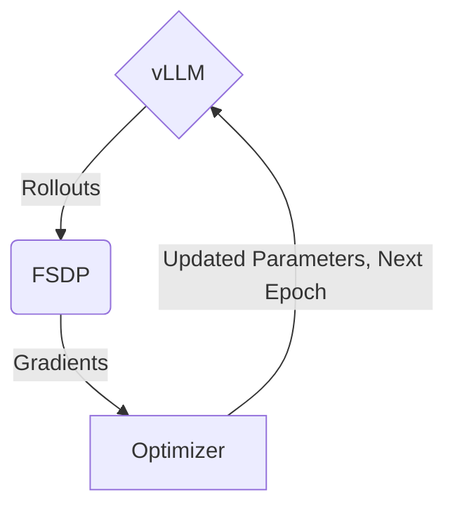

# ⚡ How FlashRL Works ⚡

This document explains the high-level architecture and implementation details of `FlashRL`, a framework for accelerating reinforcement learning with quantized rollout.

## Background: Modern RL Frameworks and the vLLM Challenge

### Standard RL Architecture

Modern RL frameworks typically consist of three core components:

1. **Rollout Generation Engine** (e.g., vLLM) - generates training rollouts
2. **Gradient Computation Engine** (e.g., FSDP) - computes parameter gradients  
3. **Optimizer** - updates model parameters

The typical workflow follows this pattern:

### The Quantization Challenge

To accelerate RL with quantization, we need both:

1. **Proper rollout generation** using quantized model served by the inference engine ✅ *Already supported in modern inference engines*
2. **Parameter update synchronization** of the quantized model with the inference engine ❌ *Not currently supported in modern inference engines*

This gap necessitates patching the inference engine (vLLM) to handle parameter updates correctly in quantized models.

## FlashRL Implementation Details

FlashRL patches two key components of `vllm.LLM`:

### 1. Model Initialization (`__init__()` function)

During model initialization, FlashRL records all properties of weight tensors **before** loading any weights. This initial state recording (referred to as `Record1`) happens only once and serves as the baseline state.

### 2. Weight Loading (`load_weights()` function)

The patched `load_weights` function follows a four-step process:

1. **Record Current State**: Capture all current weight tensors (`Record2`)
2. **Reset to Baseline**: Restore all weight tensors to their pre-loading state using `Record1`
3. **Fresh Load**: Execute the weight loader as if loading weights for the first time
4. **Restore and Update**: Recover tensors to the `Record2` state and apply parameter updates using `copy_()`

## Background: Why Can't We Just Load the Weights?

### Specialized Optimization Requirements

Quantized models employ specialized optimization techniques that significantly improve throughput but complicate implementation:

- **Format Requirements**: Kernels like `marlin` require weights to be stored in specific formats
- **Tensor Recreation**: vLLM creates entirely new weight tensors during processing, losing critical metadata about the original loading process
- **Memory Location Constraints**: Optimized CUDA functions often require input and output tensors to occupy the same memory locations for maximum throughput

### The Requirements

When updating parameters in quantized models, we must:
- Correctly compute the updated parameter values
- Preserve the updated values in their **original memory locations**
- Maintain all necessary tensor properties for proper weight loading

## Debugging and Troubleshooting

FlashRL is currently a research project with ad-hoc patches that may not work in all environments. We provide two debugging tools:

### 1. Installation Verification
Follow the [installation verification guide](./verify_flashrl_install.md) to confirm FlashRL is properly installed in your environment.

### 2. Reference Environment Testing
Use our provided resources as a control group to isolate issues:
- [Docker environment setup](https://github.com/yaof20/verl/tree/flash-rl/recipe/flash_rl#docker-environment)
- [Reference script](https://github.com/yaof20/verl/blob/flash-rl/recipe/flash_rl/gsm8k_qwen0_5B_fp8.sh)

This helps determine whether issues stem from your environment, script configuration, or other factors.
